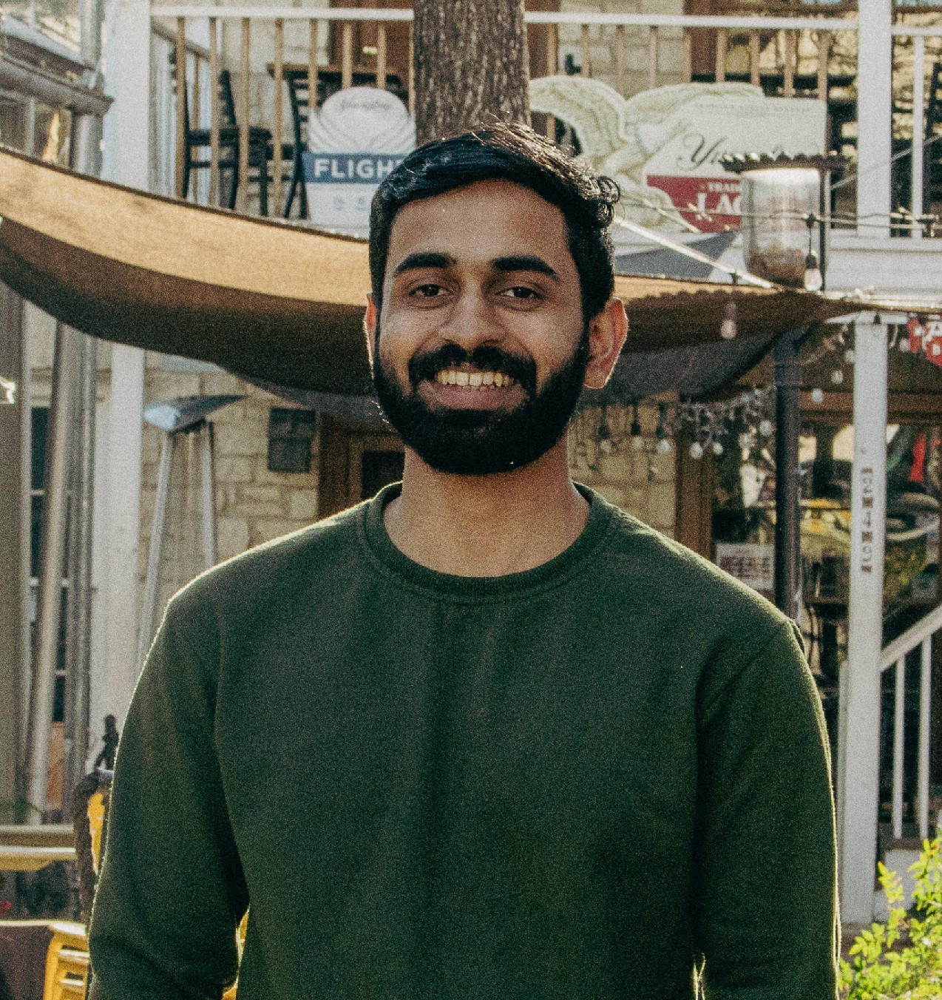

 
    

 <b>Alwin Anto</b>   <em>CSEM Master's Student</em> 

 <a href="https://oden.utexas.edu" target="blank">Oden Institute for Computational Engineering and Sciences</a> 
<a href="https://utexas.edu" target="blank">The University of Texas at Austin</a>

 <a href="files/Resume_Alwin.pdf">Curriculum vitae </a> 

 

I joined the Oden institute as a Master's student in Computational Science, Engineering and Mathematics in August 2024. Currently I work with Dr. Berkin Dortdivanlioglu on modelling soft inclusions in fiber networks using material point method. I obtained my integrated dual degree (BTech+MTech) in Civil Engineering specialising in Structural engineering from [IIT Kharagpur](https://www.iitkgp.ac.in/) in May 2022. I have a minor degree in Mathematics and Computing from IIT Kharagpur.

Prior to joining Oden I was working as a Data Scientist at [Piramal Finance](https://www.piramal.com/businesses/piramal-enterprises/financial-services/piramal-capital-housing-finance-limited-pchfl/) making credit underwriting models for new to credit customers. Apart from model building I was responsible for driving discussions with third party vendors for input features required by various underwriting models. I was also part of the credit risk monitoring team 

 

